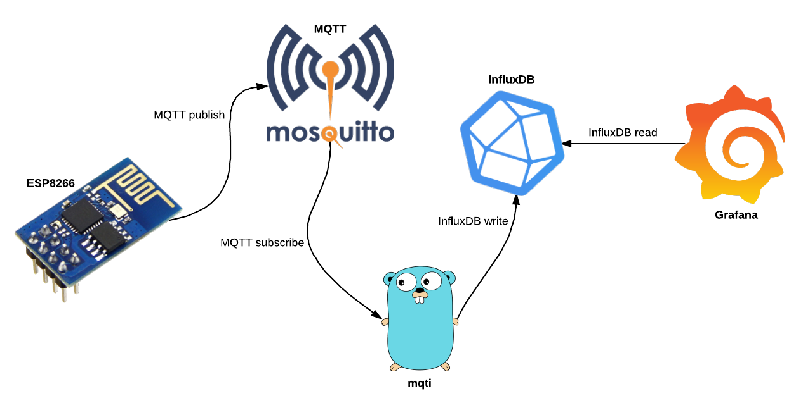

# Visualising MQTT data using Golang, InfluxDB and Grafana

Presentation given at Golang Melbourne, July 4th 2017.

## Getting started

The steps below assume Docker for Mac/Windows or via Linux, meaning exposed ports are accessible at `http://localhost:<port>`.  If you're using Docker via Virtualbox/Vagrant/other, please substitute `localhost` for your IP.

1. Clone the repo

2. Run `docker-compose up`.  This will bring up:

  * Mosquitto (MQTT broker)
  * InfluxDB (time series database)
  * Grafana
  * [mqti](https://github.com/ashmckenzie/go-mqti)
  * [MQTT temperature generator](./docker/temp_generator.sh)
  * [MQTT geo generator](./docker/geo_generator.sh)

3. The following UI's are now available:

  * [InfluxDB](http://localhost:8083/) (`root`/`root`)
  * [Grafana](http://localhost:3000/) (`admin`/`admin`)

4. Access the [Grafana UI](http://localhost:3000/), logging in as `admin`/`admin`

5. Add a new [data source](http://localhost:3000/datasources/new?gettingstarted) with the following detail:

  * Name: influxdb-iot
  * Type: InfluxDB
  * HTTP URL: http://influxdb:8086
  * HTTP Access: proxy
  * InfluxDB Database: iot

6. Click 'Add'

7. Add another new [data source](http://localhost:3000/datasources/new?gettingstarted) with the following detail:

  * Name: influxdb-owntracks
  * Type: InfluxDB
  * HTTP URL: http://influxdb:8086
  * HTTP Access: proxy
  * InfluxDB Database: owntracks

8. Now, let's [import a dashboard](http://localhost:3000/dashboard/new?editview=import)

9. Click 'Upload .json File' and select './grafana/IoT-dashboard.json'

10. Leave the name as 'IoT' and select 'influxdb-iot' from the 'Select a InfluxDB data source' drop-down

11. Click 'Import'. Your new [IoT dashboard](http://localhost:3000/dashboard/db/iot?refresh=5s) should already be showing data!

12. Now, let's [import another dashboard](http://localhost:3000/dashboard/new?editview=import)

13. Click 'Upload .json File' and select './grafana/Owntracks-dashboard.json'

14. Leave the name as 'Owntracks' and select 'influxdb-owntracks' from the 'Select a InfluxDB data source' drop-down

15. Click 'Import'. Your new [IoT dashboard](http://localhost:3000/dashboard/db/owntracks?refresh=5s) should already be showing data!
