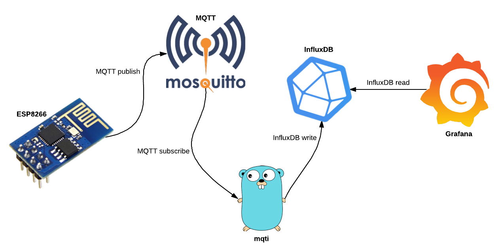
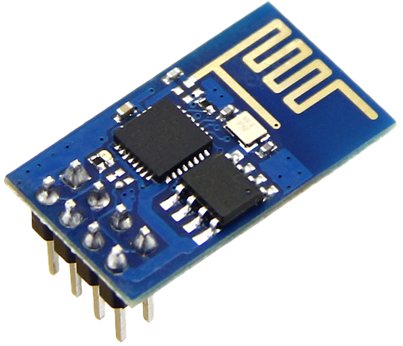

<link href="./css/main.css" rel="stylesheet">

<!-- page_number: true -->

# Visualising MQTT data using Golang, InfluxDB and Grafana

## Ash McKenzie, Golang Melbourne
#### July 4th, 2017

---

---

# MQTT, officially

> MQTT (MQ Telemetry Transport) is an ISO standard publish-subscribe-based "lightweight" messaging protocol for use on top of the TCP/IP protocol. It is designed for connections with remote locations where a "small code footprint" is required or the network bandwidth is limited.

[en.wikipedia.org/wiki/MQTT](https://en.wikipedia.org/wiki/MQTT)

---

#  MQTT, in practice

* Pub/sub messaging protocol
* Very basic protocol, consisting of `Connect`, `Disconnect`, `Subscribe`, `UnSubscribe` and `Publish`
* Perfect for resource limited devices such as Raspberry Pi, Arduino
* Many implementations, [mosquitto](https://mosquitto.org/) is fantastic
* Client libraries for Go, Ruby, Python, Java
* Latest specification is v3.1.1

---

# Mosquitto

* Open source, MQTT broker implementation
* Supports v3.1.x
* Written in C
* TLS, username/password support
* ACL restriction for topics
* [Docker image available](https://hub.docker.com/r/toke/mosquitto/) :heart_eyes:

---

# ESP8266

* Arduino compatible board
* Can also use Lua for some boards
* WIFI, deep sleep, interrupts, digital/analog IO
* Lots of variants with USB->serial included, more IO pins etc
* Easily publish MQTT messages with [MQTT library](https://github.com/knolleary/pubsubclient)
* Very cheap, ~$3AUD :scream: - checkout AliExpress :wink:

---

# ESP8266 - more variants

---

# InfluxDB

* Open source, time series database
* Written in Go
* High throughput (claims of millions of data points per second)
* [Continuous Queries](https://docs.influxdata.com/influxdb/v1.2/query_language/continuous_queries) (CQ) and [Retention Policies](https://docs.influxdata.com/influxdb/v1.2/query_language/database_management/#retention-policy-management) (RP)
* SQL-like query syntax
* Flexible 'structure'
* Client libraries for Go, Ruby, Python, Java
* [Docker image available](https://hub.docker.com/r/_/influxdb) :heart_eyes:

---

# What is a time series database ?

A database that is optimised for time centric data, often including easy data retention and downsampling.

* The original; RRDtool (used by Nagios/Icinga, collectd, MRTG)

* Other notables:

  * Graphite (whisper)
  * OpenTSDB
  * Prometheus

---

# mqti

>  MQTT subscriber that pumps data into InfluxDB.

 

[github.com/ashmckenzie/go-mqti](https://github.com/ashmckenzie/go-mqti)

---

# mqti features

* Written in Go
* MQTT v3.1.1 supported, TLS, username/password
* InfluxDB with TLS, username/password
* Consume MQTT messages and inspect (`watch`) or `forward`
* Filter MQTT messages with AND + OR expressions
* Write MQTT messages into InfluxDB including:
  * Adding tags based on MQTT fields (when payload is JSON)
  * Geohash support (e.g. messages generated by [Owntracks](http://owntracks.org/))
* [Docker image available](https://hub.docker.com/r/ashmckenzie/mqti) :heart_eyes:

---

# Grafana

* Open source, time series analytics interface
* Beautiful UI, tonnes of options
* Supports InfluxDB, Graphite, Elastisearch, MySQL, OpenTSDB, Prometheus and CloudWatch
* Includes primitive alerting capabilites
* Plugin system with 75+ available currently
* [Docker image available](https://hub.docker.com/r/grafana/grafana/) :heart_eyes:

---

---

# Demo time :pray:

[github.com/ashmckenzie/golang-melbourne-july-2017](https://github.com/ashmckenzie/golang-melbourne-july-2017#getting-started)

